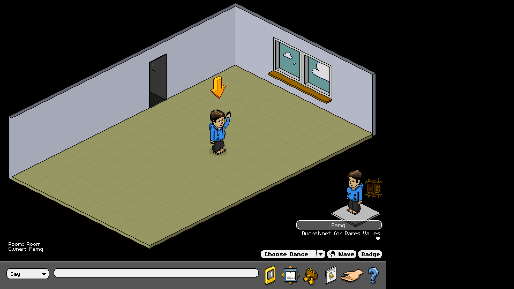
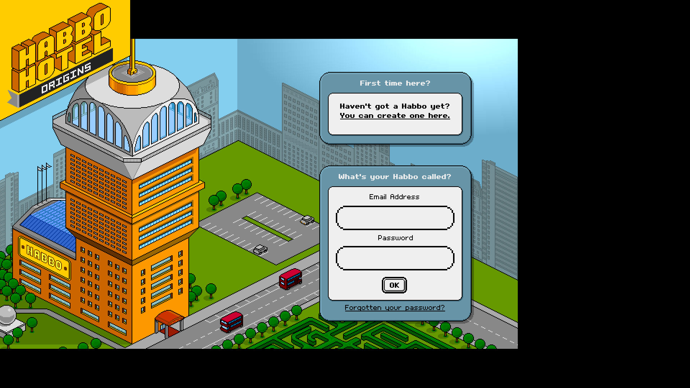
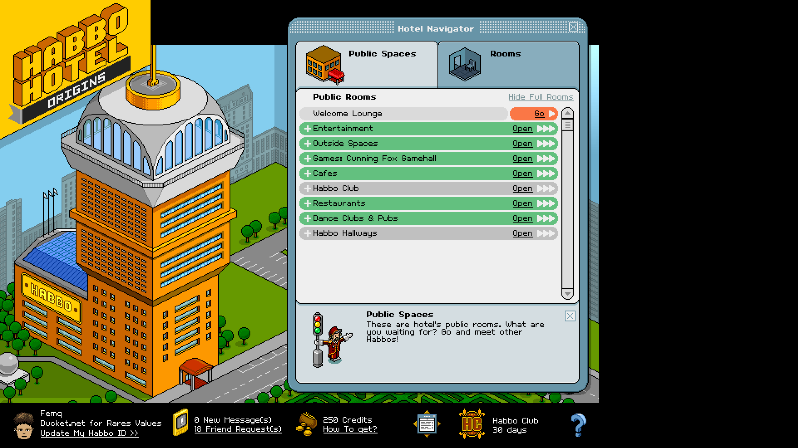

# Window Management Scripts

Welcome to the Window Management Scripts repository. This repository contains scripts and guides for managing window size and position on both macOS and Windows platforms. Whether you're looking to automate window management or enhance your gaming experience, these scripts provide solutions tailored to your needs.

## Overview

This repository is organized into three main folders:

### Advanced Python Script - Best Method

This folder contains a sophisticated Python script (`resize_habbo.py`) that leverages the `pywin32` library to manage window size and fullscreen mode for applications on Windows. Ideal for users looking to automate window adjustments for specific applications like "Habbo Hotel: Origins".

### MacOS Guide

The MacOS Guide folder includes scripts and instructions for using Hammerspoon, a powerful automation tool for macOS. Learn how to automate window centering and enhance your productivity with these scripts tailored for macOS users.

### Windows AHK

The Windows AHK folder provides AutoHotkey scripts designed to manipulate window size and position for specific applications on Windows. These scripts allow users to adjust window height, width, and centering, providing customizable solutions for window management on Windows platforms.

## Usage

Navigate into each folder to explore detailed instructions, scripts, and setup guides specific to your operating system and needs.
